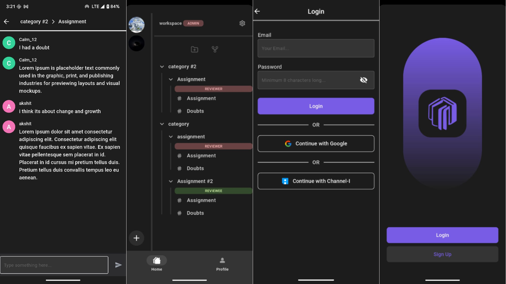

<a id="readme-top"></a>
<div align="center">
  <a href="https://github.com/Akshit517/Reviewpal-Frontend/">
    
  </a>

  <h3 align="center">ReviewPal</h3>
</div>

<details>
  <summary>Table of Contents</summary>
  <ol>
    <li>
      <a href="#about-the-project">About The Project</a>
    </li>
    <li>
      <a href="#features">Features</a>
    </li>
    <li>
      <a href="#architecture">Architecture</a>
    </li> 
    <li>
      <a href="#getting-started">Getting Started</a>
      <ul>
        <li><a href="#prerequisites">Prerequisites</a></li>
        <li><a href="#installation">Installation</a></li>
      </ul>
    </li>
    <li><a href="#license">License</a></li>
    <li><a href="#contact">Contact</a></li>
    <li><a href="#acknowledgments">Acknowledgments</a></li>
  </ol>
</details>

<!-- ABOUT THE PROJECT -->
## About The Project

<div align="center">
  
</div>

<div align="center">
  <p><i>(Screenshots)</i></p>
</div>

ReviewPal is a comprehensive assignment management and review platform built with Flutter and Django ([backend](https://github.com/Akshit517/Reviewpal-Backend)). It features real-time collaboration, structured workspaces, and streamlined review processes to enhance productivity in educational and professional environments.

Design Mockups: [Figma](https://www.figma.com/design/zbPritvMOzOXBHpDJXJGmm/ReviewPal?node-id=0-1&p=f&t=8YKPRRDBjcA3jHKT-0)

<p align="right">(<a href="#readme-top">back to top</a>)</p>

## Features

ReviewPal offers a set of features designed to streamline your workflow and enhance collaboration:

* **Workspace Management:** Effortlessly create and oversee multiple **workspaces**, perfect for organizing different courses, projects, or teams.
* **Assignment Review System:** Take control of your assignments by creating them, assigning tasks, and meticulously **tracking progress** with detailed breakdowns.
* **Review & Iteration:** Experience a comprehensive **multi-stage review process**, complete with integrated feedback loops and robust iteration tracking to ensure every task is perfected.
* **Real-time Chat:** Stay connected and communicate instantly with an **integrated messaging system** that facilitates seamless discussions among team members.
* **Team Collaboration:** Foster effective teamwork through **category-based organization** and intuitive member management, making team coordination a breeze.
* **Submission Management:** Handle the **entire submission lifecycle** from start to finish, ensuring a smooth and organized process for all assignments.

## Architecture

Here's a visual representation of the ReviewPal architecture:


<!-- GETTING STARTED -->
## Getting Started
To get a local copy up and running, follow these simple steps.

### Prerequisites
Make sure you have Flutter installed on your machine. If not, you can follow the official installation guide:
* [Flutter Installation Guide](https://flutter.dev/docs/get-started/install)

### Installation

1.  **Clone the repository:**
    ```bash
    git clone https://github.com/Akshit517/Reviewpal-Frontend.git
    ```
2.  **Navigate to the project directory:**
    ```bash
    cd Reviewpal-Frontend
    ```
3.  **Install dependencies:**
    ```bash
    flutter pub get
    ```
4.  **Run the application:**
    ```bash
    flutter run
    ```

<p align="right">(<a href="#readme-top">back to top</a>)</p>


<!-- ROADMAP -->
## To Do's

- [x] Implement WebSockets
- [ ] Add Universal Links for iOS platform
- [ ] Add App Icon and App Name for iOS platform
- [ ] Organise Prensentation layer
- [ ] Add Graph View Feature
 
<p align="right">(<a href="#readme-top">back to top</a>)</p>

<!-- CONTRIBUTING -->
## Contributing

If you have a suggestion that would make this better, please fork the repository and create a pull request. You can also simply open an issue! Thanks again!

<!-- LICENSE -->
## License

Distributed under the MIT License. See `LICENSE` for more information.

<p align="right">(<a href="#readme-top">back to top</a>)</p>

<!-- CONTACT -->
## Contact
Have questions or interested in contributing? Reach out directly via [email](mailto:akshitmandial517@gmail.com)!

<!-- ACKNOWLEDGMENTS -->
## Acknowledgments

These are the few of the resources that were helpful for this project

* [Clean Architecture Approach By Resocoder](https://github.com/ResoCoder/flutter-tdd-clean-architecture-course)
* [Implementing Applinks](https://developer.android.com/training/app-links)

My primary inspirations for the user interface design were:

* [Obsidian](https://obsidian.md/)
* [Discord](https://discord.com/)

<p align="right">(<a href="#readme-top">back to top</a>)</p>

